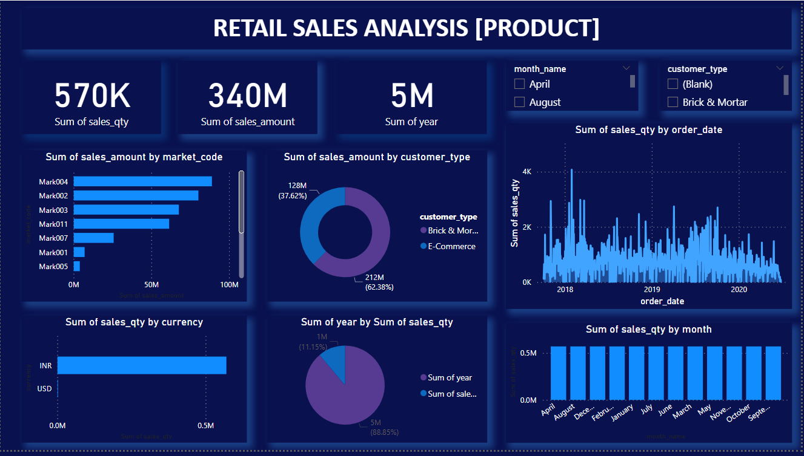

## Dashboard Screenshots

### Retail Dashboards

#### Blue Retail Dashboard

#### Red Retail Dashboard

### Sales Data Dashboard

# POWER BI DASHBOARDS

## Overview

This repository contains the resources for creating sales and retail data dashboards in Power BI using the provided datasets. The data includes sales data as well as additional retail insights for comprehensive analysis.

## Files

1. **SalesData.csv**: This CSV file contains the sales data that will be used to create the Power BI dashboard. It includes columns such as Order Date, Order ID, Product, Product EAN, Category, Purchase Address, Quantity Ordered, Price Each, Cost Price, Turnover, and Margin.

2. **RetailInsights.xlsx**: This Excel file contains additional retail insights data that will complement the sales data in the Power BI dashboard.

3. **SalesDataDashboard.pbix**: The Power BI file that contains the pre-configured sales data dashboard. You can use this file to open the dashboard in Power BI Desktop and explore the visualizations.

4. **RetailInsightsDashboard.pbix**: The Power BI file that contains the pre-configured retail insights dashboard. You can use this file to open the dashboard in Power BI Desktop and explore the visualizations.

## Dashboard Screenshots

### Retail Dashboards

#### Retail Dashboard-1

#### Retail Dashboard-2

### Sales Data Dashboard

## Instructions

1. **Download Data Files**: Make sure to download the `SalesData.csv` and `RetailInsights.xlsx` files from this repository.

2. **Open Power BI Dashboards**:
    - Install Power BI Desktop if you haven't already.
    - Open Power BI Desktop.
    - Navigate to "File" > "Open" and select the respective `.pbix` files for sales data and retail insights dashboards.

3. **Load Data**:
    - In Power BI Desktop, click on "Home" and then "Get Data."
    - Choose the appropriate data source (CSV or Excel) and select the corresponding file.
    - Follow the steps to load the data into Power BI.

4. **Explore Dashboards**:
    - Once the data is loaded, go to the "Report" view to explore the pre-built dashboards.
    - Interact with different visuals to gain insights into the sales data and retail insights.

5. **Customize and Save**:
    - Feel free to customize the dashboards based on your specific needs.
    - Save your changes and share the Power BI files with others.

## Dashboard Visualizations

The dashboards include visualizations such as:
- Time-based trends using Order Date.
- Product-wise performance.
- Category-wise analysis.
- Quantity, Price, Cost Price, Turnover, and Margin analysis.
- Additional retail insights for comprehensive analysis.
